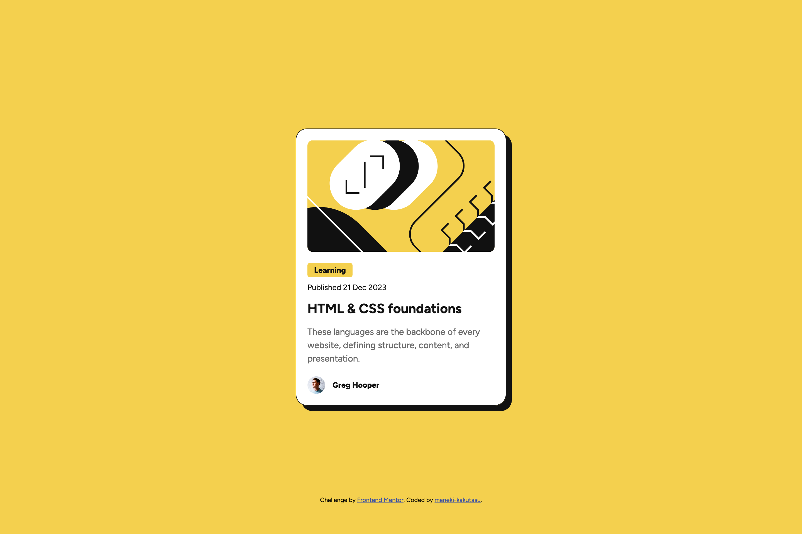

# Frontend Mentor - Blog preview card solution

This is a solution to the [Blog preview card challenge on Frontend Mentor](https://www.frontendmentor.io/challenges/blog-preview-card-ckPaj01IcS). Frontend Mentor challenges help you improve your coding skills by building realistic projects. 

## Table of contents

- [Frontend Mentor - Blog preview card solution](#frontend-mentor---blog-preview-card-solution)
  - [Table of contents](#table-of-contents)
  - [Overview](#overview)
    - [The challenge](#the-challenge)
    - [Screenshot](#screenshot)
    - [Links](#links)
  - [My process](#my-process)
    - [Built with](#built-with)
    - [What I learned](#what-i-learned)
    - [Continued development](#continued-development)
    - [Useful resources](#useful-resources)
  - [Author](#author)

## Overview

### The challenge

Users should be able to:

- Cropping an illustration for mobile version. Initially I played around with `viewBox`, but couldn't figure out how to crop it both on the left and the right (is that even possible?). So instead I just added it as `background-image` to a `div` and set its position to `center`. That way I can just change the `width` of the element if I want to crop an image.

### Screenshot



### Links

- Solution URL: https://github.com/maneki-kakutasu/Blog-preview-card
- Live Site URL: [Blow preview card](https://maneki-kakutasu.github.io/Blog-preview-card/)

## My process

### Built with

- Semantic HTML5 markup
- CSS custom properties
- Flexbox

### What I learned

```css
#learning {
  display: inline-block; /* really neat for adding background to specific formatting elements while keeping it semantic */
  margin: 0 20px 10px 20px;
  border-radius: 4px;
  padding: 4px 12px;
  font-size: 14px;
  font-weight: 800;
  color: var(--clr-gray-950);
  background-color: var(--clr-yellow);
}
```

```css
#blog-image {
  width: 336px;
  height: 201px;
  margin: 20px;
  border-radius: 10px;
  background-image: url(/assets/images/illustration-article.svg);
  background-position: center;
}

#blog-image {
  width: 279px; /* crops background image */
  height: 200px;
}
```

### Continued development

- Semantics
- Images and illustrations

### Useful resources

- [MDN Web Docs](https://developer.mozilla.org/) - literally the best HTML and CSS docs out there
- [The CSS Display Property is Changing Forever](https://youtu.be/JY0FN71vCbw?si=JCdx5g24mgn4nlqh) - a really nice video by Web Dev Simplified explaining how `display` property works (helped me with adding `background-color` to a formatting element)

## Author

- Frontend Mentor - [@maneki-kakutasu](https://www.frontendmentor.io/profile/maneki-kakutasu)
